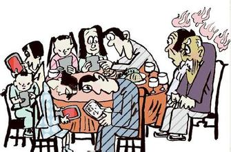

# 第一章 引言

## 为什么而写

这些年总是有人跟我说这样一句话：“你久居家中，足不出户，人太单纯，不知这世界的复杂。” 我知道他们的好意，他们怕我这个书呆子单纯得经不起任何现实的残酷。但问题是，如今的世界已经变了，如果你仔细观察一下身边的生活，就会发现如今的人们即使在面对面的时候，也在低头看着自己的手机和平板电脑。虽然这种现象的好与不好要交给历史去验证，但人们都越来越多地沉浸在虚拟世界里已经成为了一个不争的事实，他们与“足不出户”的生活也已经越来越没有区别。更重要的是，人们早已将“社会的复杂”带进了网络，并且由于网络交流的特性，这种复杂甚至已超越了传统的人际关系，网络正在重塑着我们的生活方式。

当然，作为一个生活在三线城市的残障人士，我在生活和工作上都面临着物理空间和生理条件的双重限制，选择网络这种生活方式更像是一种演化论般的自然选择。因为对我来说，代表着机会的北京、上海、甚至仅在113公里外的杭州也都是那样的遥不可及。所以在2002年，当我进入浙江大学远程教育学院学习的时候，心中既带着感恩，也带着忧虑与迷惘。感恩的是我终归如愿以偿地进入了大学，忧虑的是这意味着我从今往后的大部分时间只能待在家中，似乎就要过上的是与世隔绝，被世界遗忘的生活。我并不知道今后生活的动力来自何处，人生将走向哪里。

如果那时有人告诉我说，一个网络时代正在向你走来。我会觉得那是一个多么苍白的安慰，但如今，我已经在网络世界中生活了14年。人们在网上学习、工作、购物，谈论着网络舆论、大数据、云计算这些新概念给世界带来的改变。我在不知不觉中走到了一种生活方式的最前端。对此，我依然感恩并忧虑着。感恩的是，我很幸运遇到了一个时代，它让我的希望得以延续。忧虑的是，这个时代对我太重要了，但它才刚刚诞生，远远谈不上成熟，很多人跟我一样根本就没有准备好真正面对这个时代。心中充满了各种不同的想法，但并没有得到很好的，系统性的交流，各种矛盾、误会恒生，这些都在一定程度上阻碍着这个时代的前进，这一切使我萌发了写一本小书的想法。我希望能将自己在网络上这14年所累积的一些经历与想法整理出来。哪怕是抛砖引玉，也算是我对这个时代的一点反馈。

## 写的人是谁

虽然，我的初衷并不是要写一本自传，但毕竟我是在基于自己的经历在谈一些心得体会，所以做个简短的自我介绍还是有必要的，这有助于读者理解我的观点、言论从何而来，减少一些不必要的误会。

### 童年时代
由于周岁时的一场意外，我因脑缺氧患上了“小脑瘫痪”，俗称“脑瘫”，这是一种因小脑细胞坏死而使人失去身体平衡能力和动作控制能力的疾病。简而言之，这意味我失去了自由行动的能力，还有大部分的生活自理能力。以现有的医学条件来说，这是一个上天所判决的终身监禁。和大部分残障人士一样，我人生的最初十年基本是在四处求医的过程中度过的。

上世纪的80年代正是中国伪科学盛行的时代，人们似乎相信“科学”能包治百病，各种各样的东西都被冠以了“科学”的名义，正如今天许许多多东西都被冠以民主的名义一样。事实上，很多宣传这些东西的人自己也不怎么了解那些华丽概念背后的具体内容，但他们就是能在媒体上、朋友间将其说得神乎其技。母亲一直以来都抱着死马当活马医的态度，只要有人跟她推荐，她似乎都要试试。在那十年里，我前后试过手术治疗、中医针灸、气功推拿、吃动物骨髓、甚至于各种巫婆神汉开的药方和法事。十岁之前的我也只有接受着长辈们的各种好意，然后经历着一次次从希望到失望的过程，由此在心中留下了对于华丽概念的极度不信任，以及对迷信盲从行为的鄙视。久而久之，无论是肉体还是心灵，我再也不放心把他们交给任何虚无的信仰了。我宁可直面血淋淋的现实，也不太愿意相信有个彼岸式的未来。

在那段记忆中，治疗本身虽然也有些磨难，但终归不是最艰难的事，印象最为深刻的还是母子二人常年在外漂泊的艰辛。最终，家里花光了所有的积蓄，而当时能试的治疗方式几乎也试遍了，经济上的拮据和思想上的绝望终于使母亲最终放弃了继续在外求医的生活，于是在88年，我人生的第一阶段宣告结束。

所谓童年记忆造成的心灵创伤肯定是存在的，我从不否认这个东西对我性格的影响，有些影响是我终其一生都要时时克服的缺点，比如我对于懒惰的鄙视，对于自甘成为弱者的怒其不争，因为我觉得很多我花了几十倍的努力得到的东西，对方只是举手之劳，却如此的放纵自己。而且我也知道弱者就算得到同情，那其中的滋味也许会永久性的毁掉一个人内心深处的自尊和自信。当然，每个人都有权选择自己的生活方式，并自己承担这样做的后果，我不能用要求自己的标准来要求所有人，事实上，统一标准总是容易的，但严于律己，宽以待人，却从来不止是简简单单的八个字，试问几千年来真正能做到的又有几人呢？

### 小学与中学
学生生涯对我而言无疑是非常重要的，一方面，教育使我有足够的能力来处理童年的大部分记忆，另一方面，它使我找到了人生的成就感和方向感，这两者都对今天的我来说极其关键，然而和大多数人不一样，我享受学校教育的权利远没有想象中来得那么理所当然，相反，我不得不说它是一件非常偶然的事。正如之前所说，回到家乡，母亲就立刻回到工厂工作了，虽然早已到了上学的年龄，但母亲认为这是一件不可能的事情，因为我的病使我外表上看起来像个精神病患者，在大街上就经常被一些好事者围观，甚至有人当面问我：“喂！你是不是傻的？” 在她看来学校肯定不会接受这样的人进校读书的。于是，我就只能在家整天靠着一堆几套积木合在一起的玩具度日，那时正是《变形金刚》这部动漫风靡全球的时候，我靠着这些积木，单凭自己的想象力搞出了很多可玩性很高的机器人，它们通常组合起来是机器人，然后拆开来是各种坦克、飞机。摩托车，我记得我当时做的坦克像极了很多年后《红警2》中的天启坦克。也许就是从那个时候开始，我对设计构造物的成就感有了一种天然的兴趣。

原本以为就这样过下去了，然而在89年年末的时候，母亲一个在某小学当校医的朋友在年关拜访的时候看到了我的情况，开始劝说我母亲让我到学校接受教育，她用一个很简单的理由打动了母亲：“至少他以后能看点书。”。经过这位老师的多方奔走，我终于得到了入学的机会。

小学及初中的学习对我来说是轻松的，因为所谓应试教育，大多数时候靠的只是记忆力，而一直到高中之前，我最强的能力大概也就是记忆力了。如果不是当时过于生性好强的话，我原本是可以过得更轻松一些的，但事实并非如此，在那个时候，我在乎的并不是知识本身，而是所谓的竞争成就感。当时我对自己的要求是必须每门课都在90分以上（小学甚至是95分以上），89分都是不能接受的。这在今天看来是大可不必的行为，但对于当年的我来说，那是一个人建立自信的开始，只有这样，我才能在一群正常人的集体里找到自己的存在，虽然当年的我肯定不会像今天这样想得那么明白，但潜意识里就是有那么一种本能性的执念，它也许是自卑，也许是对命运的反抗。

事实上，我从上学之初就知道自己升学的机会渺茫，所以我学习的动力从来就不是来自于升学，它主要来自以下两个方面：

* 第一：出自我好斗的性格，对我来说，没错，升学考试是他们的战场，但我要让自己成为无冕之王，在我退出战场之前，确保他们没有机会战胜我，上天如果不公平的对待我，我会把这种感觉转嫁给他们。
* 第二：出自自身对于思考的需求，我显然有太多的时间可以用来思考，以用于面对我自身的缺点，用于解决眼前的困难，用于理解我看到或听到的迷惑。这些思考需要大量的知识和信息来消化，这驱使着我在学校里尽可能多地东西，为日后的进一步自学打下坚实的基础，因为我从来就不知道自己的学生生涯会在什么时候突然结束。我能做的就是遵守NBA所信奉的那句格言：“比赛尚未结束之前，一切皆有可能。” 利用好现有的条件永远比抱怨不公平更有效率。

当然，这种客观上有必要但其实不太健康的思想也导致了不良的后果。虽已时隔多年，但我还是必须要很坦率地说，我的高中是一个充满了错误和否定的时期，这里面虽然有些客观因素，但主观因素无疑是主要的，这种思想让我的自我定位出现了问题。那是一段漫长的痛苦岁月，它最终改变了我对于学习的认知。这一切都源自于我进入了当时非常不适合我的一个集体。正如前面所说，我一直都不知道自己还会不会继续读书。我只记得大家一致同意我继续上高中的时候，已经是8月下旬，大家都已经完成了军训，在这种情况下，我被勉强地塞进了某高级中学的一个班级。

当时，我所在的那所高中一个年级有十个班，他们分班方式是根据中考的“重点线”将学生一分为二，没过线的分到前四个班，叫做“普通班”，过了线的则被分到后六个班，叫做“重点班”，结果这个学校出现了些莫名其妙的等级制度，老师就不用说了，就连学生自己也会根据自己所在班的性质，下意识地对这两个集体区别对待，对自我的要求截然不同。

当然，以我中考的成绩是足够进入“重点班”的，但由于我进校的时候，已经基本分班完毕，而更重要的是，学校对我不够了解，怕我影响他们宝贵的尖子生，总之不管怎么说，我被分到了“普通班”，从我初中那个人才辈出的班级来到了一个每次考完试就相互问候“及格了吗”的班级，我以往那种靠竞争维持的学习动力开始失去了作用，因为我失去了真正的竞争对象和乐趣，我甚至觉得在这样一个集体里，学习好并不受到真正的尊重，自己在这些新同学眼里多少像是个异类，说实话，我那时很迷惘，一直到离开这个学校，我都很难说我适应了那个集体。

但也正是从那个时候开始，我改变了自己学习的方式。我开始偏向于自己喜欢的课程，比如历史、物理、数学、化学等，而对于语文、政治这样的课程，我基本上就是应付一下考试罢了，如果没记错的话，我政治课在高中还不及格过一次。这种态度客观上给我日后特殊的大学生涯奠定了一个很好的心理基础，试想一下，如果我当初进的是“重点班”，进大学的时候，我恐怕还是一台华丽的考试机器，这也未必真的是件好事。

到了高三的第一个学期，最后几门课的高中会考通过之后，高中毕业证书就算到手了。第二个学期就完全是准备高考的，而当时的我并没有希望读大学，我也不认为还会跟前两次那样有惊无险。因为在我看来这种运气不可能一而再再而三的发生在一个人身上，所以我做了一个决定，放弃最后一个学期，提前离校，当我把这个想法告诉家里人的时候，我外公和母亲并不十分赞同，他们认为这有点自暴自弃，不管怎么样，应该体验一个完整的高中生活，包括备战高考的过程，这类要求一直是我们家庭教育当中是很重要的思想。所幸的是，虽然不赞同，但他们还是把最终的决定权交给了我自己，而我又很难跟他们解释自己当时的状态，所以依然用一意孤行的方式做出了离校的决定。这也是我第一次在没有家人的支持下独立作出的重大选择。一直到今天，我都庆幸自己作出的这个选择，当时，我的心理压力已经到了临界点了，如果再在那种高考临头的环境下过那种混淆不清的生活的话，我不知道自己会变成什么样子。

至于我的大学以及之后的生活就正式进入了真正的网络生活，我会在后续的章节中配合自己的观点一并介绍。

## 打算写什么

通常，人们在发表观点的时候，依据的都是自己的所见所闻、人生经历。但他们往往都会不自觉地认为自己代表了“大多数的普通人”。这种心理会带来一个问题：如果每个人心中都有一个属于他自己的“普罗大众”，而且默认多数人意见是对的，那么显然跟他意见不同，就会被他认为是站在“普罗大众”的对立面。在这种情况下，要想维持理性交流的难度自然就可想而知。然而，这种心理实际上是与现实相悖的，虽然我们都是普罗大众中的一员，但每个人的生活都有自己相较于别人的独特之处，几乎没有人的经历是完全相同的，因此也不会有完全相同的思维和现实需求。正是由于“自我”与“超我”之间存在着这种微妙的心理差异，观点的产生其实更多时候是个性化的，我们谁也代表不了谁。所以我打算只说自己，配合自己的经历来表达观点。为此，我对这本书的结构安排大致如下：（这里只是初步提纲，会根据具体的写作过程来进行调整）

* 第1章：谈谈写这本书的目的，并交代一下我本人的一些背景情况、心路历程以及大致会写哪些内容。
* 第2章：结合我的大学经历，谈谈我在网络这种生活方式下进行学习的体验、看法及期待。 
* 第3章：结合我在网络社区中经历，谈谈社交网络、BBS等网络言论场中的管理以及人际交往。     
* 第4章：网络无疑给传统媒体带来了很大的冲击，对待媒体态度一直是网络社会当中的一大问题。对此我也想谈谈自己的看法。
* 第5章：谈谈个人对网络未来发展的一些预期与希望。

当然，我毕竟是一个从事计算机专业的，一年有三分之二时间呆在电脑上的人。换而言之，我在大多数人眼里只是个“书呆子”。关于书呆子这件事，我非常喜欢Pual Graham在《黑客与画家》这本书中所做的论述。按照他的定义，我毫无疑问属于黑客这个群体，自然也是个“书呆子”。

在这本书里，“黑客”是一种怎么样的人呢？当然不是黑进了别国政府的网站，然后往上贴国旗的那种人。虽然大部分人是这么认为的，因为媒体就是这样宣传的，但显然媒体所宣传的内容往往都是戏剧性大于真实性的。事实上，黑客这个称呼更多的是一种文化认同，就好像我们今天不会再去区分汉族里有多少鲜卑人，契丹人的血统，我们认同写汉字、说汉语，在生活中无意识地遵循儒释道文化的人群基本上都是汉族人。同样地，黑客也不过是一群使用代码、靠着计算语言来思考问题的人。多数情况下，他们并没想过要攻击谁，只不过有些密码之类的东西看起来很有诱惑力，让人见了心中痒痒罢了，尽管黑客创造了许多攻击服务器的工具，但他们充其量不过是一个造枪的，这个世界上大部分的攻击都是用枪的人发起的，不是发明枪或者制造枪的人发起的。即使枪没有被发明，想发起攻击的人也会找别的武器，自石器时代以来就是如此。黑客们很多时候甚至都不知道他们解了这个密码，会引发如此这般的后果，大半只是好奇害死了猫。请千万不要为此感到惊讶，这是有原因的。

首先，这些人是一群真正的“书呆子”，这些人总是会说一些“不合时宜”的话（当然也包括做不合时宜的事），例如他们在中世纪的欧洲说“地球是围绕太阳转的”，这显然是从根上“黑”掉了教会所建立的神学体系，后果很严重。但这些人并不关心教会的位置，他们不知道“反教会”是什么意思，更没有想到说了一句人们不接受的话就会被烧死。在书呆子的眼中，事实本身的辩证比政治立场重要得多，也有趣得多。这些人也许只是不想那么复杂，甚至不愿意那么复杂，当然有时候不复杂的代价是他们没有想到的，大概这就是人们所谓的“书呆”吧。

其次，这个世界有太多“不能说的话”。例如在欧洲，以前不能质疑上帝，如今不能质疑普世价值。无论如何，每个时代都有一些“不能说的话”。如果要说出来，我们就成为了异类，成为了异类就会成为被恐惧的对象，如果这些异类的能力还很强，就会变成邪恶的化身。但如果不说出来呢？这取决于我们是不是乐于做几百年后子孙眼里的那群蠢货，比如当年围观布鲁诺被烧死的那些人。那该怎么办呢？事实上我们不能把握的事情太多了，何止是这个例子那么简单，说与不说，都只能求个问心无愧。

所以，如果我在这本书里说了什么得罪人的话，希望读者能尽量往善意的方向去理解。
