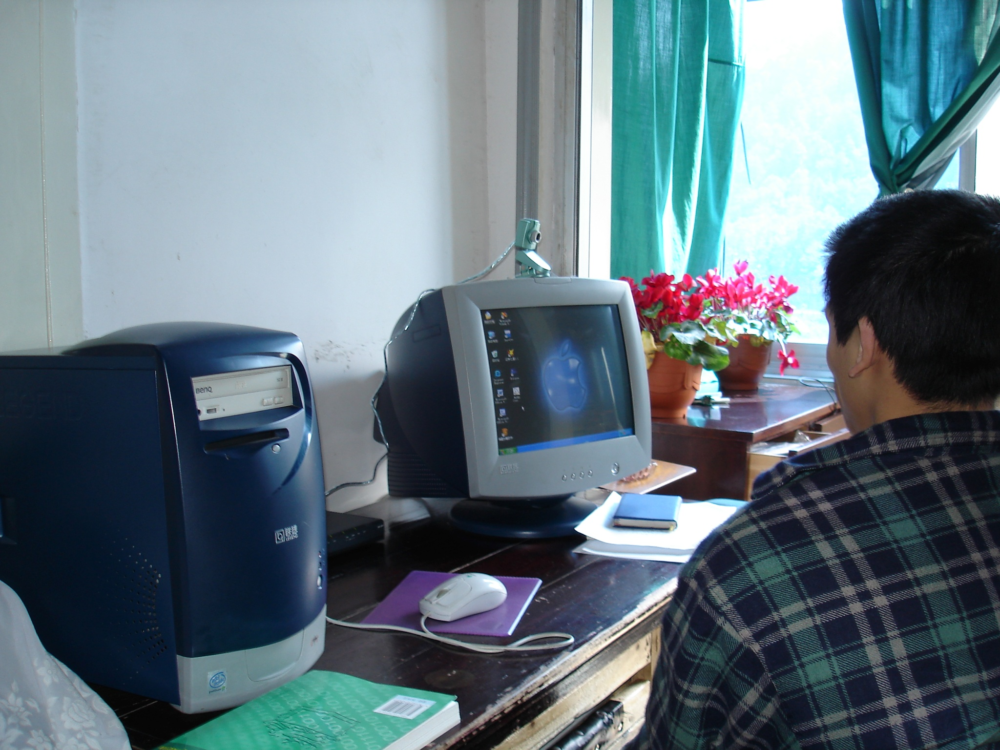
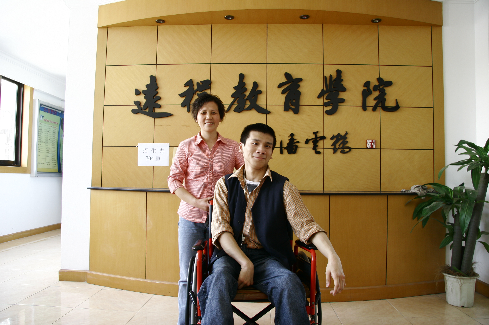

# 第二章 学习

自2006年大学结束至今，虽已工作多年，但我在更多时候依然感觉自己还是个学生，似乎每天都还是在学习。因为严格来说，我是个在家工作的自由职业者，会定期或不定期的参与一些大学、计算机专家个人的研究项目。同时也会参与一些主要计算机技术类出版社所组织的外文专著的翻译工作。因此，随时都有可能要面对新的知识，新的项目，这种工作性质决定了长期的自主学习是一项必须具备的能力。而网络为这种能力的培养提供了无限的可能。

## 游乐之下的启蒙

要谈到在网络中的学习，自然要从接触计算机开始。我最早学习计算机大约是在1998年前后，用的是母亲办公室中的一台Intel 586，也就是后世所谓的第一代奔腾机。那台机器在当时可谓是名震天下，若有人说自己有一台586的PC，众人皆仰望，其威风不亚于孙猴子手握金箍棒，可上天入地。所以，每次坐在这等神器面前都如同朝圣一般的虔诚，一举一动都显得战战兢兢，加上脑瘫本身带来的动作不协调，常常搞得自己大汗一身，几近虚脱，今日想来，当时摆弄的也不过是几个DOS命令，然后学习点五笔字型的输入法罢了，如此刘姥姥进大观园之状，也算是可笑之极，但我与计算机的缘分也确源自于此。

到了高中时期，学校周围出现了一系列叫做“网吧”的小黑屋，校方对它们是讳莫如深，三申五令禁止入内。但正如同一切禁令一样，这反而更激起了人的好奇心。于是某日放学之后，我就跟着同学去一探究竟。那时候网吧中最流行的是《红色警戒2》和《帝国时代2》的网内对战。要知道，这类游戏相当于让我们一时之间有了指挥军队作战的机会，对于一个生性好斗的男孩来说这是何等的诱惑啊，哪里还顾得上什么清规戒律，皆当鸟语了。从那之后，每周末必呼兄唤弟，结伴去那小黑屋杀它个天昏地暗。所幸在下一直以来都自制力尚可，不曾因为游戏影响过学业，玩游戏这件事没有引来长辈、师长的关心。在下《红警2》之名故能盛极一时。需要指出的是，我在游戏之中不知不觉所掌握的计算机基本操作和日常技能的数量要远超过在母亲办公室那段所谓的朝圣时期。因为在游戏求胜欲望驱使之下学起东西来，那种动力是正儿八经地学习五笔字型时所没有的，这显然是一种更发自于内心的、更为原始的求知欲。

当然，母亲最初可以对我每周末在网吧鬼混的行为装聋作哑，但毕竟我的身体常去网吧也确实是多有不便，时间一长，她也认为这不能长久这样混下去。于是在2000年末，家中终于添置了一台奔腾2机，内存64mb，硬盘10g。这对我来说简直是如获豪宅，自然再也不去那小黑屋中厮混。而且此后的兴趣也转向了去折腾Windows 98系统，比如，如何安装盗版游戏，如何搞鼓注册表之类的，作为日后的计算机专业人，到了这一步也算是顽童归正了。

即使在计算机已如此融入日常生活的今天，我们也依然会看到不少人对计算机抱有或多或少的恐惧之心，仿佛稍有不慎便会得灭顶之灾，险字当头令人寸步难行，其实不妨转念想想，我们为何不能以冒险为乐呢？学习就应该因兴趣而起，寓学于乐，多试多练，最后做到了熟于心。一句话：凡高手者，唯手熟尔。

当年的Windows 98与Windows 2000之后采用NT内核的系统不同，这个系统相对来说是不太稳定的。那时只要稍有折腾，一天死机三四回，如家常便饭，有时候甚至三个月之内会重装系统数十回。对于此等盛况，母亲看了是心惊肉跳，大有立刻去买防爆服给全家全副武装的架势。我倒是满不在乎，尽管当年对于什么注册表，动态链接库，系统服务之类的东西从概念到实际几乎是一概不知，基本上就是怎么破坏怎么搞，搞坏了再想法子修好它。通常上机的时候是糊里糊涂，焦头烂额，鸡飞狗跳，然后在吃饭睡觉时倒常会脑中灵光一闪，悟出半点端倪，然后就无来由的哈哈大笑，吓得旁人魂飞魄散，这才知道陶渊明所言：“好读书不求甚解，每有会意，便欣然忘食”的深意所在，不为别的，只因为“好玩”。这其中的道理对于学习编程也是适用的，编程这件事无非就是一个使用编程语言和算法的过程罢了，在学会基本单词和语法之后，模仿学句即可，正如汉语学习中所说的“读书破万卷，下笔如有神”一样，积少成多，不断顿悟，久而久之，自然随心所欲，行文如流水，自成风格了。到那时，你不会特别在意什么文法、算法、模式了，最后无非就是一种自然习惯。所谓的无招胜有招，并不是不讲规矩，而是任何想法，写法都很自然地落在规矩之内。

想要明白这个道理，我们不妨可以先来回顾一下自己是如何写文作诗的。写东西的首要目的是什么呢？无非就是为了记录事件和想法，并与人分享罢了。然后在表达准确之余，再来求得一些行文优美，让人读起来有身心舒畅，荡气回肠的效果。但如果我们本末倒置，为几个用词折腾到“三年得二句，捻断数根须”的地步，且不说我们有几根胡子，这样写出来的文章恐怕也就空有华丽，而毫无灵魂了吧？这确实得不偿失，计算机也是同理，我们在学习中如果要每件事都务求全解，不然就止步不前，患得患失，那自然会如履薄冰，寸步难行。

王国维说过：“出乎其外，别有高致，进乎其内，固有生气”。学习这件事要想长久下去，最终得需求一乐，唯有如此，我们才能潇洒应对，凭所学穿越于这世间，求得一席之地以安身立业。

## 我的大学

接着上一章所介绍的情况，由于我在高三时并不认为自己还会再有上大学的机会，因而放弃了用于准备高考的最后一个学期，在那个学期中，我在家按照自己的兴趣自学过一些东西，特别是一些恶作剧脚本的用法。其中印象最深刻的是一个叫做【飘叶千夫指】的QQ信息炸弹，这种工具可以通过QQ瞬间向对方发送成百上千条垃圾信息，以导致对方的QQ出现软件崩溃，而考虑到Windows 98的不稳定性，软件的崩溃时常也伴随着系统死机，这个小工具在当时算是个简单易用，且颇具点攻击性的小玩意。当然除此之外，我也搞鼓过不少针对网页的恶作剧脚本，如果各位还有印象的话，你们那时候一定不小心点到过那种会一直弹出对话框，弹到你系统崩溃的链接吧？像JavaScript这一类浏览器端的脚本在那时有相当大的一部分就是拿来搞这些恶作剧了。

尽管以现在的眼光来看，我当时这可真算得上是无知者无畏，像个愣头青似的拿着一些别人写好的脚本干了不少恶趣味的“好事”。但在干这些“好事”的过程中，我对于这些脚本背后的技术也越来越好奇了。随着这些好奇心的积累，我也在不知不觉中将注意力转向了这些技术。虽说我当时在技术领域中做的都是些闭门造车式的瞎琢磨，那也称得上是其乐无穷，而且也还真学会了不少东西，譬如查看注册表的键值结构、开关某些系统服务、获取某服务器的ip地址之类的，这其中大部分都是东一棒头西一榔头地从网络中、书中看到的一些技巧，但我并没有任何理论层面的学习，完全随着兴趣而走，多少有点盲目。

正当我真的以为自己从此就这样自学下去的时候，母亲偶然看到一份招生简章，说浙江大学有一所可以在网络上学习的大学，觉得可能我有望试试看。于是我们向我的中学要了一份推荐信，请残联开了相关证明，就向浙江大学远程教育学院提出了就学申请。没想到这一申请，又将我的学生生涯奇迹般地延后了四年。当然，在这里我要特别说明一件事：由于我并没有参加高考，入学之后也不曾参加过学院的正式考试，所以尽管我在2005年被学院授予了“荣誉学员”的称号，但我并没有拿到正式的毕业证书。这当然无疑是个遗憾，但毕竟我得到了实质上享受高等教育的机会，以及大学所提供的教学资源，这又岂是一纸证书能替代的。当然，清楚地说明这件事是很有必要的，我也不应该到处胡乱吹嘘自己是浙大毕业生，不然如果万一日后搞出什么动静，被方舟子这样的打假人士抓住把柄，事情可就不好办了（这话说得可真够自恋的，不是吗？）。

在继续回顾我的大学之前，请允许我在这里简单介绍一下远程教育这一教学形式。远程教育（Distance education）是一种依托电视及互联网等传播媒体来进行教学的教育方式，它可以突破空间的限制，不像传统的教学模式需要学生那样居住于校舍，安坐于课室。目前使用这种教学模式的学生，通常都是些业余进修者。由于不需要到特定地点上课，因此可以随时随地上课。学生亦可以通过电视广播、互联网、辅导专线、课研社、面授（函授）等多种不同管道互助学习。

在中国，过去开办远程教育的大学一般被称为“广播电视大学”，简称“电大”。这是一种依托于广播、电视机等传统媒体的教育形式。互联网兴起之后，各省国立大学依托自身已有的教学资源纷纷建立起了各自的远程教育学院。我所在的学校正是浙江大学的远程教育学院。当时，浙江大学在远程教育上的具体做法是：在各地开设多个教学站，就地招生，就地管理。上课的时候，把签约老师在总部上课时录制的视频和老师自己写的教学材料合制成一个课件，放在一个FTP服务器上。然后给各教学站一个账户，并提供一个课件专用的播放器，由各教学站的老师负责播放给学生。除此外，学院还会提供一个基于Web系统的作业交互系统，供远在总部的老师们管理和批复全国各教学站的学生作业，完成师生交互。当然，由于我受到学院特别照顾，同时享有学生和教学站管理员的权限，上述所有的事都是我在家中独自完成的，自己下载课件，自己安装课件播放器，自己去跟老师交互，我的自由度显然远大于其他同学。

毫无疑问地，这种教学方式很大程度上要依靠学生自主学习的能力，如果它的受众是自学能力足够好的学生，这种方式是非常合适的，但如果它面对的是中学应试教育中走出来的一群考试机器，他们中的很多人之前只有考试、拿文凭的经验，其自主学习的能力有没有保障就很难说了。也许对他们来说，这种教育形式就有点太自由了。但话说又回来，我也并不觉得自己当时对于远程教育这四个字有什么概念，可能也只当作是一个不需要留校的大学罢了。而这可能恰好是我日后学习成果还不错的一个主要因素。坦率地说，这等于是又一次遇到了瞎猫碰上死耗子的好事，它让我很快地形成了一套自己的大学作息习惯：每天一般睡到中午起床。从下午1点起到晚上10点之前，我是在一边回复着各种电子邮件，参加着各种线上讨论（这之中有学习讨论的，也有跟人胡闹的），一边让计算机自己下载着学院的课件。到晚上10点后，洗完澡开始看一天的课件，一直看到凌晨两点。然后在学院的交互系统上提交作业以及一些问题给老师，到三点睡觉，一直到今天，我都维持着这个自己戏称为巴格达时间的作息习惯，只不过如今之前的这部分变成了工作时间，晚上10点之后的这部分则至今依然是我的学习充电的时间，这对我来说效率是非常高的一种安排。

今天如果回过头去想一想，我在2002年开始所经历的那4年远程教育无疑是很幸运的。当时基于网络的远程教育整体还处于试点的初始阶段，市场定位其实并不清晰，有很多人是因为高考成绩不理想，而又想变相取得所谓名牌大学的文凭而纷纷踊跃参加的，这掀起了一股不小的热潮，而我正巧赶上了。但如果我在高中时期没有经历过那样的在学习态度上的转变，或许我也会想着要浙江大学的毕业证书。在那种情况下，我还能不能真正适应这种教育形式也真的很难想象。所以所谓的“幸运”，很多时候并不仅仅是外部所给予的环境条件，还要看我们自身所具备的能力演变是否恰好与外部条件相匹配，也就是说，一个人是否“幸运”从来就不只是他有没有机会那么简单，更多时候还要看我们是在什么情况下得到了机会，机会来的太早或者太晚，都谈不上“幸运”。

总体而言，我对自己4年的大学生涯是非常满意的。在那段时间里，我接受了一个计算机专业本科生该有的系统化教育，为之后的发展打下了一个坚实的基础。有了这个基础，我才能不断地深化自己的专业素养和技能，以至于如今在一群同专业的硕士、博士朋友中间工作、交流起来都不会显得太费劲。至于那一纸证书，对于我这个在家工作的人实际上反倒没有多大的意义。何况在2012年，由于工作上的一些小成绩，我被学院评为了浙江大学远程教育的“首届十大远程骄子”。这也基本已经代表了校方对我的认可。

## 学习不止于那殿堂之上

谈到这里，读者可能已经发现了一个问题：我几乎是完全在家里完成了那四年的大学，虽然我可以从学院服务器以及各种视频网站上收看到相关的课程资料，可以依靠远程学院提供的系统与老师交流。但校园生活呢？显然如果仅仅是如此的话，那么与同学、朋友的交际、分享这一块无疑是欠缺的。当然，对此我也找到了替代方案。

在我的生命中，上海交通大学饮水思源BBS的意义不亚于一所大学。在那里，我结识了很多一生的朋友，经历过爱情，管理过社区，组织过社团活动。我在其中收获了技术讨论的快乐，与人辩论的脑力刺激，也见证了各种管理问题、人际间相互理解的困难。总而言之，它很好的弥补了我校园生活的欠缺，这部分我会在第三章中详细记述，这里只谈学习相关的部分。

让时间回到2003年的10月，那年我大二。在经历了一年适应之后，我不满足于那时候的学习状态，有太多无处安放的精力不知道往何处发泄。要知道一个残疾人经特许进入了大学，是一件多么不容易的事情，自己的良心不能容忍将大把的时间花在打游戏、瞎聊天之类的事情上。于是，我开始自己尝试着在编程能力上寻求突破，那时我读的教材是谭浩强的《C程序设计语言》，虽然依靠它，应付C语言的课程是没有什么问题，但一种本能让自己发现所学的这一切，似乎只能用来做题。我那时甚至都不理解指针指向的地址到底是内存中的地址还是硬盘中的地址，更谈不上做点自己想做的事情。然后在某一天，我随手拿起了一本《计算机应用文摘》，看到了一篇很奇妙的文章，具体的内容我已经忘记了，反正就是批评了谭浩强那本教程的教育方式，批评得深得我心。然后作者强力推荐了C语言设计者的巨作《the c programming language》，这使我当即决定找这本书来看看，为了寻找这本书的原版，我联系了这篇文字的作者，加了他的QQ，然后就经常拿着各种问题骚扰他。和所有的初学者一样，我当时总是有很多今天看起来很毛躁的问题，比如如何学好指针，为什么这样编译不通过，什么编译器好之类的，说实话，如今我自己也怕在QQ上被别人问这些，因为这不是适合用即时通讯软件来讲解的东西。所以，大概是为了不让我只烦他一个人，他给我介绍了一个BBS，说可以在这里问你想问的问题，这就是饮水思源BBS，更具体的说是该BBS的C语言讨论板块（我们通常简称“C板”）。在最初的那段日子里，我对该BBS的认识也仅限于c板，每天参与其中各种话题讨论，并亲自实验讨论结果。在经历了无数次的讨论和辩论之后，我终于找到了自己对于专业学习的思考方式。

台湾著名的主持人蔡康永曾经在《奇葩说》的某期节目中说过，大学教育基本上还是属于通才教育，研究生之后才是真正的专才教育。我是同意这一观点的，至少对于计算机专业来说，大学本科阶段的教育还真谈不上任何程度的“专业”，它基本上所能做的就是为我们日后的“专业素养”提供一个入门方向的理论准备。而真正的入门、深化还需要我们在此基础上做出更为实质性的努力。明白这点是很重要的，因为我们在大学时期对自己的专业都会有一些不切实际的抱怨，越早抛弃这些抱怨，反而越能有助于实际提高我们的专业能力。

首先，我们不能太过期待学校教学与时下业界流行的无缝接轨，即使是斯坦福大学的IOS开发课程，它每年都在名称上更新版本号，但其从讲义到内容实际上并没有多大的变化，介绍新增的功能基本上也是一笔带过，这原本就不该是大学教育的重点。个人认为就计算机专业来说，在大学时代最应注重的是：*可持续之学习能力*。计算机技术发展速度是如此之快，我们要指望依靠学校教育来追赶是不现实的。在以后的工作中，我们必须要具备“在做中学，在学中做”的能力。换而言之，你能一个月或者更短的时间内学会什么技术，远比你从学校毕业时已经学会了什么技术重要得多，比如你在大学学习了四年的java，有了不错的使用经验，这很好，但我们几乎每个人都有同样的能力。但如果你从此刻开始，凭着自己的专业素养在一个礼拜内就能学会Python，并上手做项目了，那么我们很多人可能就不如你了。

其次，计算机教学最困难的地方在于如何在实例细节与教学引导之间找到合适的平衡点。对初学者来说，如果没有教学引导性，缺乏轻重缓急的安排和一个循序渐进的过程，很可能就会不得其门而入。而如果缺乏足够的、可以立刻上机测试的代码实例，又会让他们觉得兴趣黯然，学习过程形同嚼蜡。这就需要教学者有丰富的教学经验以及带队开发的经验。有了前者，我们就能熟悉教学心理，知道先教什么，后教什么，之间如何承前启后，将人一步一步引入到技术运用中来。而有了实际带队经验我们就会知道新手在具体实践中会遇到那些情况，并且能准确的预料到学生在运行什么代码时会遇到什么问题，而在这种情况下往往是一点就通，不用长篇大论，事倍功半。

在这些方面，不能不说我们的大学与国际名校之间存在着很大的差距。那些学校的老师很多都曾是在一流计算机企业工作过的资深程序员。或者是直接参与行业标准制定的顶尖科学家。他们既熟悉行业内的具体情况。有着丰富的商业项目经验，也熟悉学术研究的规律，知道如何教学。再加上他们有着信息更为自由，讨论更为开放的环境，优势是不言而喻的。所幸的是近些年来，这些国际名校陆续都向社会开放了一批制作精良的公开课，以作为远程教育的另一种形式。而网络的存在则打破了物理空间与国界的限制，使得来自世界各地的人们都能共享这些优秀的资源。例如我们既可以看到斯坦福大学请苹果公司资深工程师来教授的《iOS开发》课程，也可以聆听《算法导论》作者本人所教授的同名课程。如果您的英文不是很好，也没关系，网络各处都有无数无私的志愿者帮助您为这些课程视频配上优良的字幕。这些课程既涵盖了计算机专业，当然也包括其它学科的方方面面，内容从具体的实业操作到深度的理论研究应有尽有。我们可以从中得到最资深的业界经验，最前沿的学术成果。关键就在于我们自身有没有长期求学的欲望，以及自主学习的能力。至少我本人这一路走来，从这一途径获得的知识不可谓不多，帮助不可谓不大。

除此之外，我们还面临着另一个问题：学校里的课程往往更偏向于理论，对实景演示并不是很在意，这方面也是在网络上找到解决方案的。自YouTube、优酷这类社交性的视频网站问世以来，就一直有很多民间的计算机高手在上面发布一些自己制作的教学视频。这些视频往往都是屏幕录制式的，即这些视频记录的是制作者本人在计算机上的操作过程，并同期配上他自身的音频解说。这些教学视频往往有很好的演示性。例如，如果您想了解Linux系统上的操作与开发，我曾记得有一套叫做《LinuxCast》的视频给了我很大的帮助，那就是一套以实景演示为主的视频，我们可以一步一步跟着他做，效果是立竿见影的。等学会了这些操作，再回过头去看我们在学校里学的那些关于操作系统的理论，理解起来就要容易得多。同样地，要是您想了解Mac OS X系统，则可以去看看王自如等人的MacOS系列视频，我从中也学到了不少东西。它们同样也可以被视为是远程教育的一种形式。

## 黑客文化

## 本章小结

