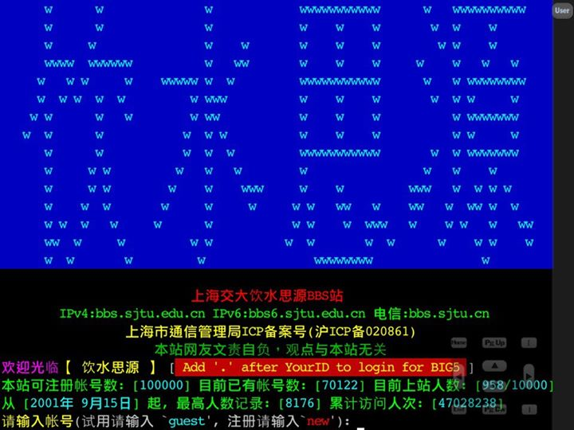

# 第三章 社区

在上一章中，我重点谈了学习这件事，很容易让人觉得这是在描述“一个被生活逼着做宅男的家伙如何自强不息”，十公里外就能闻到那浓浓的鸡汤味。虽然这印象与事实也相差无几，但至少从写作目的来说，心灵鸡汤不是我追求的东西。事实上我也非常忌讳用残疾人的身份来宣扬一些所谓正能量的东西。因为如果我这样做了，事情的结果，也就是这种鸡汤文所带出来的“榜样”效果会盖过所有的努力和运气。我不想告诉人说“只要做什么就会如何如何”，这种简单公式般的道理是我不相信的，自然也很不乐于去宣扬它。比起“千里之行始于足下”，我更愿意说“摸着石头过河”，每个人都有自己的成长经历，并以此来形成各自的经验、方法以及机遇，靠亚伯拉罕式的造神运动来推广某种特定的价值观是没有意义的，我们每个人都应该要回归到自我现实。

说到价值观表达这件事，我这些年来还一直目睹着一个残酷的现实，我将其称之为"表达的困境"。就像上一章一样，我自以为一直在表达的是如何认知自我，如何根据自我来行动，如何避免价值观僵化。而读者所读到的常常就是“只要努力就会成功”这个僵化的逻辑。做这样的判断倒不是对自己的表达能力没有自信，而是我亲眼目睹过太多次这样的落差。正是这种落差驱使我愿意用一章的篇幅来谈谈言论表达。具体到网络时代，这事要从线上论坛说起。我之前已经说过。上海交通大学的BBS站对于我而言，意义不亚于另一所大学，但这所大学的意义并不在于学习，而在于这个时代所特有的社会历练，这种历练包含了如何与人交流，如何生活在一个以言论表达为主要功能的社区，并参与它的管理和建设。

说起我在饮水思源站的经历，我可以说自己是成功的，因为我参与过该站各个层次的管理，有过一些影响力，我也是该站永久账户成员之一（这个永久帐号就相当于球员的名人堂）。但我也认为自己是失败的，因为我见证了一次又一次知识分子之间的恶性交流，他们自大而脆弱，滥情而理盲，只有立场是非没有思辨角度，并且彼此之间恶意曲解、抹黑。我周而复始地在这个论坛的各个角落见证着一个又一个劣币驱逐良币的故事，无论作为管理者还是作为意见领袖，我都有着长久的挫败感。现在，我希望将这一切有条理的写出来，并期待这些东西能发挥一些作用。

故事要从BBS最基本的讨论单元“板面”开始，先来聊聊板面的治理。

## 3.1 板面治理

正如上一章所说，我最初在BBS上的活动仅限于学业讨论，也就是上一章介绍的那个“C板”，这是一个讨论C语言编程的地方。大约是一年之后，有一次我们在讨论如何提高讨论水平，板面上的几位主要人士对比了饮水思源站与水木清华站，得出的结论是清华的C++板水平比较高，其原因除了天子脚下卧虎藏龙之外，主要在于他们建立了一个专注于讨论水平的规范和氛围。但这并不是我们第一次意识到这个问题，C板的板主们也几次三番想推动类似的规范，建立类似的专业氛围，但始终被一些人认为这是“对初学者不友好”，并因此发动各种针对性的挑战，故意提出各种初级入门问题，意图是激怒板主，引发管理争议。让问题由专业学术转向人情社会，结果不但让规范无法推行，板主还屡屡被BBS管理层用板务等行政因素而撤职。

基于这些问题，我当时提出了一个看法：应该要说服水源站的管理层改变这种重德不重才的官僚风格，否则要推行水木的规范是很难的。没有想到这看法却成为了板主们招揽我加入板务管理的机会。他们给了我两个理由：第一，我和管理层之间没有任何历史纠葛，新来者推动改革或许会容易一些。第二，我比其他人更像一个纯粹的技术人士，因为我当时基本上不去其它版面，没有额外的纷争来给这些管理层产生刻板印象。听了这些，我有些心动，但说实话，由于我对接触官僚这种事情有着一种很强烈的排斥感，深深不觉得自己的性格会比之前的那些人做得更好，这使我心有忌惮。直到某一天傍晚，我再一次看到一位C板板主因为一个很幼稚的管理问题而被撤职，甚至在我看来，与其说那是管理问题，倒不如说那是一种荒谬的诛心表演，我可不认为对初学者问题有点专业上的不耐心能上纲上线出霸凌网友的问题来，但水源管理层就是认可了这是霸凌网友。这使我一时怒从心来，当下决定接手这位板主的位置。

直至今日，我也从来不认为自己是一个适合做管理的人，但幸运的是我管理的是一个以程序员为主体的板面的，这相对而言要简单一些。具体来说，程序员在网络上的表现可以被分为两大类人：

* *技术写作者*：这一类人对技术问题有很强的理解和表述能力，能用文字把一个比较复杂的问题解析成层层推进的逻辑，但他们可能会认为，回答问题只要把问题的解决思路说清楚，代码自然就会写了，用不着举例子，这毕竟不是在写书。
* *纯技术工作者*：这一类人往往是直接用代码来说明问题的，甚至有时候只给问题关键部分的代码。文字说明基本上是没有的，代码中有点注释就已经很好了，这是他们的经理都很头痛的问题。何况在讨论区，这还不是他们的工作。

在技术版面中，最大的问题就在于这两类人在讨论区中对初学者来说，都确实不太友好。事实上，我们每个人都曾经是初学者，都知道在那个阶段，人们看到问题思路的说明就会希望你给他实际的代码抄，而看到实际的代码又会希望你给他详细说明一下，同时还希望你像他最好的老师一样耐心而和蔼，并且还不用交学费。且不说这种要求理直气壮得让人难以理解，更为重要的一个问题是：既然我们都经历过这个阶段，难道不应该更清楚这种心态不该被纵容吗？我们要问自己一个最基本的问题：对于一个讨论区来说，究竟是讨论的专业性重要，还是大家都表现得谦谦君子，一起构建和谐社会重要？尤其在初学者完全可以先看书，使用搜索工具之后再来提问的情况下，我们对不太上道的问题有些不耐烦的态度真的会成为社区管理的核心问题吗？请试想一下，如果我们让越来越多专注于专业水平的回答者受到专业能力之外的指责，他们是更愿意走人还是更愿意接受你的道德教育？当初学者在你这里看不到专业的回答时，他们又会不会因为这里的谦虚和和谐而留下来呢？到了那个时候，这个社区还会剩下什么？所以究竟什么才是一个讨论社区最重要的事情？是讨论水平，而不是社区和谐。这更深层次的问题就在于你是尊重专业还是尊重官僚。

当然，有人会问“把初学者都吓跑了怎么办？”，这其实要看我们怎么看待“淘汰”这件事，且不说有没有一门专业是不会淘汰初学者的，我们只需要抛开情绪。认真想一想世界上是否存在没有淘汰机制的社群，就会有答案了。很显然，如果我们构建社区的目的是要避免“无情淘汰”，那是不现实的，注定要失败。那么剩下的问题是：我们希望这个社区的淘汰机制是良性的，还是恶性的？现实会告诉我们，如果一个社区总是劣币驱逐良币，最后劣币也会无法生存，我们同情弱势，但要找对帮助弱势的办法，不要重演《动物庄园》中的悲剧。管理者不应该忘记经营社区的基本规律，没有内容的喧哗只是一个社会衰败的开始。

## 3.2 内容之死

说到这里，我们就难免要回答一个核心问题：“怎样的讨论才算是有内容的？”，虽然我之前已经说过，有内容的讨论应该形成优胜劣汰的良性淘汰机制，让所有参与讨论的人尊重专业，专注于技术本身，每个人都愿意为参与讨论做好知识准备，实验论证，理性辩论并总结经验。但细节决定成败，泛泛而谈解决不了具体问题。究竟“怎样的讨论才算有内容”，我们得具体举例来说明。在我的印象里，饮水思源站的电脑技术区至少在2008之前是不缺乏内容的。当时在C版，几乎每个讨论主题都有很多不同的角度，从语法分析到编译器差异，从编程范式到设计模式，从宏结构的意义到中间层的作用，无论是作为版主的我们，还是版面上的常驻网友，我们大部分精力都在话题本身，虽然也时有争吵，但大多也是就事论事。在那段时间里，这些讨论驱使我读了大量的书，做了大量的实验。那些专注于技术的日子，是我如今一直在回味的愉悦记忆。

所以，如果我们要想让讨论有内容，对于讨论议题的干扰必须越少越好。譬如说，我们要讨论如何实现某个网站，讨论焦点应该就在这个网站的功能，实现这些功能的算法，这些功能未来的升级空间以及用户使用这些功能的体验（包括访问速度，数据安全等）这些问题上。在具体讨论中，我们可以讨论是否采用Linux平台，是使用php还是java，是否采用关系型数据库等，但必须围绕着我们的讨论焦点，在这类问题上，糟糕的讨论往往是从“A已经过时了，现在大家都用B”开始的，这个问题在某个公司考虑产品推广的时候是有用的，因为大部分非专业人士对“采用最新技术”的产品有一种社会性的消费冲动，但这是商业议题，不是技术议题，我们是在一个技术讨论区，而不是在项目经理人会议上。更重要的是，我们是开发人员，不是项目经理。如果我们是被要求必须使用B技术，那我们一开始就应该讨论“如何用B技术实现某个网站”，而不是讨论A是否过时了，B是否该被采用，然后把商业与技术混为一谈，你强调市场，我强调技术，你想刺激消费，我想降低成本，最后你认为我是个科学呆子，我认为你是个铜臭商人。专业呢？专业不见了，内容自然也就不见了。

显然，一个人在讨论技术问题的同时把自己想象成一个商人，他就会失去技术讨论的聚焦能力，这就是对议题讨论的干扰。而且这还不是最糟糕的，更糟糕的情况是我们还把自己当成了社会运动家，譬如，如果我们在上述议题中再加入是否要支持开源运动，软件是否是自由的，微软的商品是否是邪恶的，设备是中国的还是美国的，议题讨论就会进一步上升到意识形态和信仰之争。这样一来，我们彼此就不止不能沟通了，那简直就是不能共存了。这时候，谁还会记得我们是在讨论技术？专业早就被遗忘了，虽然讨论很热闹，但事实上已经毫无意义。

如果你认为这已经是最糟糕的讨论了，那显然是低估了人类作死的能力。怎么可能会少了政治因素呢？由于好一点的社区管理员都会意识到当讨论上升到意识形态和信仰之争的时候，讨论就没有意义了，为了维护社区讨论氛围，他们通常会用管理权终止讨论。这时候，某些人就进入了最狂热的角色：挑战管理者，追求自由，公平。他们会故意挑起意识形态和信仰之争，挑衅管理者，引起他们的管理缺失，然后让管理者下台。这种行为对于技术社区几乎是毁灭性的，首先，由于是故意要挑起争议，所以他们在意识形态上必然是偏激的，带有攻击性的，这会让意识形态和信仰之争更为剧烈。其次，技术社区的管理者往往是志愿者，他们加入社区管理是因为对技术本身的热爱，他们不懂政治，也不是政府，不靠网友的税收生活，你让他们在管理法规上疲于奔命，不止会让社区管理失去焦点，还会严重打击他们参与管理的积极性，造成社区管理层的反向淘汰。社区管理员是维护社区讨论氛围的最后一道防线，一旦它开始崩坏，那就基本不用指望良性讨论了。

那是不是只有技术社区是如此呢？当然不是。事实上应该说，技术社区这种相对单纯的地方尚且如此，其他领域更不敢想象会何等的糟糕了，比如中医问题，转基因问题，台湾的核能议题等，我们的网络中充满着各种以科学为幌子，以自由为口号，手里拿着钱，心里想着乌纱帽的鸡同鸭讲，为人民发声。在这样的环境里，你想讨论科学，他就质疑你民族自尊；你想讨论技术推广的合理性，他就说你妖魔化技术；你想讨论科普，他就说你要毁灭地球。然后伴随着各种层次的抹黑，封杀，对抗。确实很热闹，但内容已经死了，劣币驱逐良币的进程开始了，社会等待着下一场灾难。

## 3.3 人之江湖

到目前为止，我们聚焦的是BBS的版面讨论。从议题讨论的角度，我们希望它少受到商业的，政治的，人际关系的干扰，但有人的地方就有江湖，有江湖的地方就必须要面对管理上的问题。事实上，如果我们希望版面讨论能少受外部因素的干扰，最理想的选择是将管理问题，或者说政治问题放在版主的上层管理来解决。在这里，我需要稍微介绍一下饮水思源站的管理结构。其最高层是站务组，主要由四到五位站长，若干站务助理和帐号管理员组成。这些人拥有整个BBS上最大的权限，可以在全站范围内封禁或删除任何一个用户，还可以任免下级管理员。站务组之下是BBS站上的各大版面分区，分区的作用是对版面进行分类。这一级的管理员叫做区长，每个区最多可以有三个区长，区长的主要职能就是负责招募和任免版主。分区之下就是版面了，它的管理员叫做版主，每个版面最多可以有三个版主，主要负责管理的帖子，和用户在该版面的封禁。譬如说，我当时所在的C版属于第三分区，为电脑技术区，我是C版的版主，我的上级是三区区长。

比较特殊的是，饮水思源站在其1997年以来的发展历程中，逐渐在主要管理层之外另外设置了一个组织，叫做仲裁庭，负责的是用户对各级管理员的投诉，并且为了让这种投诉机制化，饮水思源站发展出了越来越复杂的站规，版规，投诉条例。我想不用我多说大家也知道这样的设置是出于怎样的思想和用意。只不过正是这种设置让我从根本上开始怀疑它背后所代表的思想，想起来也真是讽刺。当然这是后话，当时的我和所有人一样，出于同样的理想，对这种设置有着一种很高的期待，直到我自己参与进去为止。

下面让我们回到当年的饮水思源站，看看我在这个小小江湖中所经历过的事。事实上，应该说在2007年之前，我很少参与版面以外的管理事务，即使在版面管理上，也是少说多做，谈的也都是学习的态度和技术的问题，虽然那个时候三区区长，也是我的好朋友Azureday经常私下问我（当然，我估计他问的肯定不止是我）对某某板面有没有什么推荐人选，我也乐于帮他一些忙，甚至替他去搭讪一些人来当板主，但也就到此为止了。

然而作为计算机技术的讨论社区，三区有一个比较特殊的情况，那就是无论如何，版主在版面上都是要具备一定的“权威”的，因此，不管是一般版友还是版主的申请人都对版主的技术水平有自己心里的一把尺，这个问题导致了很多有时间的人都没有底气去申请版主，而有底气的人大多数已经面临毕业或者已经工作了，他们的时间是个大问题，因此在三区寻找一个版主是比较困难的。而作为长期形成的繁复规定之一，他们要求每个版主在每个学期都要向区长提交一份“述职报告”，如果逾期不交，版主就会被处分，撤职，结果在2007年就因为述职逾期不交发生了一次多个版主被撤职，区长记过的事件。当时心中的不满驱使我选择第一次面对站务组，与他们展开了争论。当时我有两方面的目的：一方面，我希望简化一些不必要的行政手续，一个网上社区实在不需要那么官僚的体制运作，这不符合实际情况。另一方面，更重要的是，我想切实的了解一下站务组的想法，以分析一直以来对他们管理理念不认可的根源在哪里。

那场争论大约持续了三天，具体的过程我大多数已经忘记了，只记得我一直强调BBS站的有些规矩就像皇帝的新衣一样，没有什么实际的作用，应该考虑简化甚至取消这些规定，而一些管理层的人认为我不尊重这个BBS站的管理理念，甚至还有认为我不懂现代管理理念的意思，认为我是在恶意闹事，目的是想将三区特殊化。这样让我们双方完全没有交集，也不想形成共识，于是就一直针锋相对。当然，我得承认我在用词上一直是不太客气的，而某一些站务组成员也和大多数中国人在辩论时一样，到最后无一例外地选择了上纲上线，一开始说我是在搞小团体主义，最后甚至发展成了攻击所有的三区版主都是不干活耍威风（大意如此，原词记不住了）的人，这一下连Azureday这样温文尔雅的人也被激怒了，开始出现了几个版主辞职抗议的情况，最后由主席站长出面调解，此事才不了了之，唯一的结果可能就是，那件事让站务组和我彼此之间都留下了很不好的印象。

而在BBS站之外，同样也在那一年，对中国网络环境影响深远的华南虎造假事件已经名满天下，以twitter为代表的Web2.0应用开始铺天盖地，网络正在成为中国的第一大媒体和言论场地，然而管理的标准并没有建立，民间和官方展开了旷日持久的拉锯，直到十年后的今天也依然如此，在这种情况下，由水源开天辟地那一代在1999年前后那个比较干净的环境里建立起来的乌托邦一样的制度，是否会面临挑战，饮水思源站将走向何方？这些问题我当时也并没有想明白，只是隐隐地觉得有些不对劲了。

然后时间一晃就到了2009年，借着去上海交通大学回访我的朋友Azureday的机会，我想组织一场三区的聚会，顺便见见这些年来在水源三区结交的大部分朋友，然而那时我实际的身份只是WebDevelop版的版主，因此我决定给自己一个名正言顺的身份来号召这次难得的聚会，申请三区区长。然而，我是一个喜欢最大限度利用资源的人，既然我要当区长，就应该利用机会实践一些自己的设想。

首先，作为又一个站规设计，申请区长的人必须要到BBS站的0区的Recruit板提交申请书，然后接受所有人的质询，然后站务组要根据我受到的质疑和获得的支持来决定是否任命我。由于我的管理风格和在freetalk版发表的言论（关于freetalk版的事情，我将会在后面的篇幅中专门讨论），我知道秉持那种所谓“现代管理理念”的站务组对我是颇有疑虑的。但我一点也不担心这件事，以我对三区事务的了如指掌和这些年积累的基层支持度，通过足够的支持人数显然不是问题，而对于三区以外人士的质询，其实我完全可以打太极，装作温良恭俭让，但真这样做就不是我了。而且，我依然想知道站务组在面对所谓“才”与“德“的问题会如何取舍，是否可以有所改进，所以依然选择了针锋相对，那次实践的结果是：虽然他们对我的言行风格甚为担心，但由于我坚持个人言论与其管理能力无关的观点，并凭借本人在三区的支持度，最终还是通过了申请，我成了三区区长。

当时，我和Azureday做了权责分工，由于他的实习业务繁忙，我负责日常事务，一旦我和站务组有了冲突，我希望他做一个缓冲和调解的作用，我以为这样这样可以减少在区务运作上一些不必要的麻烦，然而事实证明，我太天真了。事实上，当我还在freetalk版发表那些让站务组里某些人颇为感冒的言论的时候，就明显感觉到我在华南虎造假事件中看到的某些令人担心的行为终于蔓延到了这个BBS站，各种以“自嘲为屌丝，loser为名来挑战各种权威”的行为艺术开始在网络的各个角落里玩得风生水起，而饮水思源站这种没有政府权力，却有着一套很像政府机制的社区显然就成了这种行为的理想游乐场，毕竟这些行为艺术家大部分都属于“欺负真正的流氓没本事，欺负老实人那是比流氓还流氓”的人渣。

一时间，水源那原本就死板而漏洞百出的站规和仲裁条例，以及环节繁琐的行政流程开始备受一些人有意的刁难，他们可以连续几个月地在BBS各大分区中寻找管理疏失，然后以此为由提出投诉，仲裁，一个个版主，区长，站务人员应声倒地。这让我真正开始反思这个制度背后的设计思想。这件事情的正向思考应该是让这些事件的发生倒逼我们完善法规的设计，补上法规的漏洞，但我们忽略了一个根本的事实，那就是我之前所说的，饮水思源站的管理者大部分都是志愿者，他们不懂政治，没有受过专业的法律培训，没有能力去面对这种刁难，修补制度漏洞，更重要的是他们也不是政府，不靠网友的税收生活，没有义务去为了完善管理法规而疲于奔命，这个游戏唯一可能的结果就是打击人们参与BBS站管理的积极性，形成管理层的反向淘汰。

所以唯一合理的做法就是放弃这种不切实际的制度设计，让管理回归单纯的网站，专注于议题讨论，而不是这种似是而非的政治游戏。为此我向当时的站务组建议了无数次，然后这件事就发生在我自己身上了，那帮人终于找到了三区某一位版主在五个月之前的一次不严肃版务，向我提出了投诉，按照他们的步骤，只要我稍有差错，他们就会向站长上诉，站长再有差错，事情就会到仲裁庭。于是我并没想太多，只是觉得这件事无论结果如何，我都不能让玩这个游戏的人“很有成就感”，所以我选择针锋相对地故意恶心他，摆出一副父母官的样子，让这位“告状的”自己把事情说得明白一点再做处理，谁知这位朋友太急于表现他作为挑战者的优越感和成就感了，公然弄了一个假版规来表示他对我的鄙视，还公开承认这是一种嘲讽行为，于是我在警告无效之后，给了这位仁兄一次不大不小的封禁。然后就等着他的继续表演。

事实上，我从没担心过他的投诉，因为：

1. 我封禁他的理由是假造版规，这在全世界的法律理论里都是说得通的，几乎是一种普世规则。
2. 我无论操作的过程如何，结果都是以最后的操作为准，而以最后的处理结果来看，并无任何不当之处。

唯一还有能说的就是所谓的“服务道德”问题，我生平最恨的就是两种人，第一，是自己不努力只想别人帮忙的懒汉，第二，就是眼下这种以挑战别人为娱乐方式，自以为很有优越感的行为艺术者，这两种人休想从我这里得到任何的帮助，或者他们想要的优越感，我一定会以他们最反感的方式来回应他们。

当然，更重要的是我想借此机会，与站务组好好谈谈我的建议，但我发现他们认为我不尊重现代管理理念和饮水思源站管理文化的想法一点都没有改变，而对此投诉案几乎以一种拖的方式消极对待。这时候，我感到了一种莫名的失望，我需要为自己打算了。我决定要在投诉案作出结果之前主动离任，这对于那一类人来说是一种很好的嘲讽，他对这种结果一定会无比的反胃，虽然表面上他似乎是扳倒了三区区长，但没有任何成就感，而且我也确信最后的结果不会对我有任何处罚，他将什么都得不到。后来事实证明也确实如此。于是2009的夏天，我彻底结束了对网络社区管理的参与。

## 3.4 freedom？liberty？自由？

在参与BBS管理事务期间，为了了解那些人经常心心念念的“现代管理理念”，我读了很多与西方政论相关的书籍和网络资料，譬如关于“四个自由”的论述，分权制度的核心思想和基础环境，然后用它们来反思饮水思源站的制度设计和管理理念。但我很快就发现，这种反思不能闭门造车，除了要具体进入这个制度（譬如申请区长），还必须要知道这个制度之下的人们对“自由”，“分权”这些概念的具体理解，也就是说，除了那些漂亮的口号之外，他们在条件允许的范围内到底是怎么践行这些理念的，这很重要，要喊口号的话，只要够厚颜无耻，他们想怎么喊就可以怎么喊，但如果真的有机会去实践，结果往往会让人大跌眼镜。当时的饮水思源站有个叫freetalk的版面就是这样一个相对可以践行“free”的地方，我也没想到自己有这样的耐心，在那里一呆就八年，直到2016年才带着彻底的失望离开。而且，事情巧得很，在我离开之后一年，这个版面就关门大吉了，因此我今天可以毫无顾忌地把我在那里的经历写出来，这不会造成任何实际的影响了。

即便如此，我也不想过多地介绍这个版面的实际情况，大家只需要知道这是一个讨论政治理念，以及时事新闻的版面，虽然也受到一些限制，但已经比大多数地方要“free”。这个版面上的大部分网友绝对符合人们对知识分子的定义，高学历的海归，留学生，以及很多自称事业有成的都市白领。但他们具体的表现如何呢？在我作出评论之前。先带大家来看几个我亲身经历的讨论吧（如果那真的能算“讨论”的话）。

### 阿拉伯之春

如果大家对2010年的时事稍有记忆的话，一定都记得当时在网络上有不少讨论在这件事发生之后就跟着纽约时报、CNN一起欢欣鼓舞，认为普世价值之光降临到了阿拉伯世界，世界上的黑暗只剩下朝鲜和它的西边了（这些人的原话），freetalk版就是其中之一。但是我的历史常识和平时看到的新闻都在告诉我，如果阿拉伯世界举行一人一票的选举，由于以色列的存在和他们的宗教文化，他们只能进入一个宗教化的，反美反西方的社会呀。在全民选举的情况下，决定社会走向的是民众，我们不可能指望依靠几个接受过西方教育的异见人士来建立一个西方愿意看到的民主世俗社会，这显然是矛盾的。但我万万没想到，我的这些观点遭到了那些朋友前所未有的围攻。先是千方百计反驳我的观点，然而一厢情愿终归辩不过历史与现实。接着就发展到我是为了拿“五毛钱”说话，然而这种抹黑吓不退我，于是他们最后把这个上升到了信仰问题，只有立场，只有相信不相信普世价值的问题，正如我之前所说，一旦讨论变成了信仰与意识形态之争，讨论就已经毫无意义了。于是这件事到最后就变成了纯粹的，对我个人的批斗和谩骂。那是我第一次亲眼看到这些平时在呼吁言论自由，让不同意见共存的人，所谓的知识分子，做出了如此荒谬绝伦的表演，真是让人大开眼界。

说真的，这些人既没有自由的思想，也没有自由的素质，他们只有以自由为名的革命冲动。我甚至敢说只要条件允许，他们大部分都会变成自己今天在咒骂的人，而且绝对青出于蓝而胜于蓝。

### 转基因之争

在网络环境里，没有科普议题比转基因的争议更典型了。说实话，无论是方舟子们认为这是好的技术，应该鼓励推广，还是崔永元们认为技术推广太不顾及人们的疑虑，应该强制其标识说明，他们说的原本就不是一个问题，他们之间的水火不容是因为商业，毕竟主张将转基因食品强制标识本质上会降低投资者对转基因技术的信心，而不强制标识会打击有机食品的市场，造成孟山都这样的大型垄断。所以一方认为崔永元们是在妖魔化科学技术，另一方认为方舟子们是在毁灭人类生态，双方都号称自己是为人民说话，这是市场经济的常态，没有什么可奇怪，我会在第四章专门讨论网络时代的媒体。

但作为被他们代表的人民，我们自己在freetalk这样的地方分成两派，相互谩骂，对抗，这是为了什么？为了娱乐吗？我们把微博，新语丝这样地方的鸡同鸭讲搬过来重新演一遍，好玩在哪里？为了科普吗？科普难道就不应该考虑双方的问题吗？我们不需要争取转基因的研究经费，支持一下强制标识并不影响我们对转基因技术的认知吧？如果科学只能被相信，它还是科学吗？它变成宗教了吧？科学本来就是逐步获得人们的信任的，譬如我们一开始就信任电吗？当年民众对电的恐惧逼得爱迪生花钱组织护卫队来保护电网不被拆呢，那些成本会低于转基因食品的强制标识吗？或者说，民众的恐惧是你硬塞给他们，或者让他们无条件相信科学家就能解决的吗？

这次我倒是没有亲身参与进去，但看着这些平时呼吁理性，使用科学方法论的人们几天几夜地，成百上千贴地吵得天昏地暗，一模一样地从鸡同鸭讲发展到信仰和意识形态问题，我不禁地想，这些人尊重科学吗？尊重专业吗？尊重不同意见的人吗？尊重自由讨论吗？这还是在没有实际利益冲突的情况下呢，如果背后有实际利益，那真不敢想象他们会做出什么事来。

### 韩寒的代笔疑云

这是我见过的最荒谬的网络争议之一，提出质疑的一方不过是利用群众的八卦心理，根据一些文笔上的似是而非的推理来质疑韩寒的某些作品是他父亲代笔的。无论他们的分析成不成立，这些也都属于推理，而不是证据。而通常在正常情况下，质疑别人的一方才是应该负责举证的，结果不是，这些人一方面是利用舆论逼着韩寒自证清白，一方面靠分析韩寒的自证来继续推理游戏，进一步扩大事态。在我个人看来，这就是一个典型的、文革大字报式的流氓炒作。

结果freetalk就有这样一群人，天天等着韩寒自证，每一次自证都是一次文笔分析，扮演福尔摩斯的狂欢。在他们眼里，提出质疑的一方可以只有一些似是而非的分析，而被质疑的一方就必须自证清白？这些人平时在呼吁法制精神是这样的吗？他们追求的新闻自由环境是这样的吗？他们的狂欢里有半点身为知识分子的社会责任感吗？这是所谓的打假吗？我真心觉得可耻。

如您所见，这个版面的讨论模式就是：先树立靶子 to 分队站好立场 to 开始对轰，在这过程中：

* 如果你没有立场，他们就把你无条件的放到对立面；
* 如果你同意他的立场，就必须同意他们所有的观点；

当然，公平的说，大多数时候他们所批判的对象确实有很多可批之处，只不过他们具体的行为给我的印象总是让我觉得，与其选择听他们的建议，不如选择当下的情况比较有安全感，尽管他们中也有大约百分之二十是比较有思想的，但要让真正的自由深入人心，不用说官方，就是民间自己也没有给彼此留下多少空间。

## 3.5 为什么信仰之争毫无意义？

相信读者读到这里，一定会想让我回过头去解释一下为什么“信仰和意识形态之争是毫无意义的”？我是想说人不该有信仰吗？当然不是！信仰是我们在不确定的世界中寻找确定性的心理机制，这几乎是学会思考之后的必然结果，属于人类的本能之一。所以我的观点和“人该不该有信仰”这件事无关，我要讨论的是人的“信仰行为”。为了说明这一点，我打算分三个方面来论述：

### 上帝与教会

人与神的关系似乎从文明之初就开始了，那时候的人类比今天更为脆弱，面对大自然，面对同类，面对自身的生老病死，几乎没有一件事是确定的。因此如果能有一尊神存在，这尊神就提供了一种确定性，他可以帮我们解释大自然的闪电，解释死亡，解释我们与同类的关系，在文明之初，这种解释的对错并不重要，重要的是我们因此缓解了思考能力带来的困惑，抚慰了心灵，有了方向，这一切使得我们能在这个充满了不确定的世界中生存下去。这就是信仰的作用。显然，即使在今天，这种作用依然是不可或缺的，无论我们把这尊神叫做命运，上天，真主还是上帝，其作用在本质上都是一样的。总而言之，我们是需要信仰的。

但人毕竟是社会性动物。信仰免不了要与社会管理，也就是我们的政治行为产生联系，政治与信仰的结合就是相同信仰的人聚集在一起成为了宗教，宗教行为就是我所谓的“信仰行为”，从事这种行为的典型代表就是教会。教会本质上就是一种以信仰为旗帜的政治组织，它的主要作用是保护某种它指定的信仰，并声称这种保护能让神保护这种信仰之下的人。既然是要保护，那就必须要有威胁，于是就有了魔鬼和魔鬼之下的人。而在现实中，教会就是把不同信仰，甚至相同信仰的不同派别当成了魔鬼。在这种情况下，我们争论信仰上的不同看法，实际上是在一而再，再而三地确认对方是魔鬼，越争论越想消灭对方，这样的争论当然是没有意义的。

教会的巅峰当然是在欧洲的中世纪，他们让西方社会将希腊，罗马的文明忘记了一千年。虽然在新教诞生和文艺复兴之后，基督教大部分教派都做了世俗化的改革，实现了政教分离，但西方社会在“信仰行为”上的本质并没有发生变化，他们分离的不过是神与政治，不是信仰与政治，连信仰与政治的关系都没有变。也就是说，他们只不过把神权变成了人权，把神喻变成了主义，把神主制度变成了民主制度，我们在意识形态上的争论和信仰之争是一模一样的，没有任何意义。

而且，相信大家肯定也发现了，我们面对的是一个很讽刺的事实：我们的心理需要信仰，初衷是为了让自己与世界和平相处，但信仰行为却成为了教会这种组织的权力来源，它引导我们走向相互毁灭。所以还是停止争论，让信仰成为每个人最深层的隐私吧，这样才能真正主宰自己的命运，否则任何形式的民主都只是你为民，他们为主，就算你手里有那张选票，也比当年天主教的除罪票好不到哪儿去。

### 信仰与科学

当然了，有人认为自从伽利略与牛顿开启现代科学时代以来，人类对世界的不确定性有了更多的解释能力，在科学方法之下，信仰是可以被讨论的。坦白说，我自己曾经就是这样想的，直到最近几年才发现根本不是这么一回事。

首先，科学不是一种信仰。它不能给我们确定的答案，相反，它的本质是想告诉人们世界原本就是不确定的，而科学本身只能提供一种思考方法，所有的思考都必然会带来困惑，我们得习惯困惑。另外，科学是鼓励怀疑的，任何科学结论都有求证和证伪的方法，而被证伪的科学结论都会带来新的科学结论和新的困惑，因此，对于“上帝存在”，“人权与生俱来”这种命题，我们既没有方法证明，也没有方法证伪，它们不属于科学领域，我们用科学方法论来讨论这些命题是毫无意义的。

其次，科学很容易成为信仰的伪证。这方面最典型的例子应该就是达尔文的进化论了，作为十九世纪最伟大的科学发现之一，进化论的提出原本是对上帝信仰提出了极大的挑战，因为它对物种起源提出了比“上帝造物”更可求证的解释，达尔文在他的第二本书《动物和植物在家养中的变异》中详细解释了进化论的四大基本原因：第一，过度繁殖，第二，生存竞争，第三，遗传变异，第四，适者生存。其中的核心思想其实就是世界的不确定性。具体来说就是，由于生物演变的方向是不确定的，所以一个物种要想生存下来，繁殖的数量是第一位的，一个物种有了足够多的数量才能与其他物种进行生存竞争，生存竞争的压力会触发遗传变异，然后在自然选择之下才有最后的结果，适者生存。但这种不确定性对信仰是毁灭性的，因为人类在进化论面前是相当脆弱的。他的进化能力远不如老鼠，更不如细菌。但人类很快发现，进化论的结论，适者生存这一条很有用，于是在传播过程中有意忽略掉进化论的前三条前提。搞出了”社会达尔文主义“这样荒谬绝伦的东西，把一个国家，文明的当前优势解释成了物种优势，把自然选择变成了神的选择，神的选择又被教会或类似的政治组织定义了，于是进化论一度成为了种族主义的论据。这一切都是在试图用科学方法论来讨论信仰的过程中产生的，我们还把它称之为科学与神学的和解，多么讽刺的一件事。

那么科普工作能不能解决这个问题呢？很不幸，恐怕不能。原因也很显而易见，科学理论往往复杂而不确定，需要受众有学习的能力，神学和类似的政治信仰通常简单而确定，不需要受众有学习的能力，科学在大众传播上是有短期劣势的，而政治组织需要的也只是短期的传播优势，你说科学一百年后让人明白了真理，那有什么用？这些政治组织已经搞死了几百个国家，几千万人。因此在我看来，不让政治组织有机可乘的办法，还是只有我们不讨论信仰。

### 辩论与吵架

最后我们来看看争论这件事本身。争论的形式通常有两种，一种叫做辩论，它是双方在事实与逻辑上的攻防，这对于讨论是有意义的。另一种叫做吵架，它是双方在情绪上的冲突，对于讨论本身是毫无意义的（唯一的意义就心理上的情绪发泄）。那么，信仰和意识形态是可以辩论的吗？显然是不行的，因为对于辩论来说，它的重点是事实和逻辑，而立场某种程度上就等于逻辑漏洞，基本上有立场就必有漏洞。善于辩论的人很了解一个议题中所有立场的立论和漏洞。而信仰的前提就是立场不能改变，它会让人无视任何不利于该立场的事物，而面对不利因素的唯一方法就是情绪化，正因为如此，我们会看到所有与信仰和意识形态相关的辩论，几乎无一例外都是以剧烈吵架收场。

终上所述，信仰与意识形态之争是毫无意义的。

## 3.6 同温层效应

用“同温层”这个概念来形容人际关系，我还是在Facebook上从台湾人那里看来的。当然，这件事得从头说起，自从对饮水思源站，尤其是对freetalk板上的那些人彻底失望之后，我就将参与网络社区的重心迁移到了Facebook上。之所以选择Facebook，原因主要有两个：

* 第一：我认为饮水思源站的常驻网友从曾经的八九千到如今的不足一千，主要是因为其管理层教条式的管理理念，业余的官僚制度，眼高手低，脱离实际情况。他们反驳说是因为BBS本身的技术老旧，比不过Facebook这样的新型网上社区了，它的衰退是必然的，管理不是主要问题，我想看看是不是这么回事。
* 第二：我在思考freetalk板上那些知识分子的表现如此让人失望，是不是我们的教育和社会环境造成的，如果换个不一样的教育体制和社会环境，情况会不会好一些呢？由于众所周知的原因，Facebook上的华人社群主要以台湾人为主（当然也有香港人），自然是一个不错的观察点。

结果非常遗憾，我透过Facebook看到的台湾是一个被具现化了的freetalk版，由于跟freetalk版的讨论氛围相比，他们更没有限制，更自由，于是我在freetalk板上的讨论现象在他们那里都被放大到了整个社会，整个社会被分成了两大阵营， 他们称之为“蓝和绿”，这两大阵营之间几乎在所有议题上都不一致。在政治上，双方都骂对方内政独裁，外政卖国，双方都认为自己代表了民主、自由、科学与法制，对方什么都不是，甚至连人都不是（他们相互称呼对方为“俎”）。在民生上，从核能到环保，再到农业所有的议题都不过是我们转基因问题的放大版，双方各自怀着不同的内心，用着冠冕堂皇的说辞在党同伐异，水火不容，恬不知耻地消费着民众的恐惧情绪和科学常识。在舆论上，到处都是方舟子式的流氓炒作，每天晚上媒体的黄金时段，各种号称专家，教授在他们所谓的政论节目上口沫横飞，一模一样的，质疑者只需要似是而非的分析、爆料就可以逼着被质疑者不断地自证清白，甚至还能影响法律，他们自己都把这种现象称之为“名嘴办案、媒体治国”。我对freetalk上那些人的担心，似乎是无一例外地在台湾社会里得到了证实，就是那些无耻的，号称是支持自由民主的知识分子搞得整个台湾社会到处乌烟瘴气，荒谬当道。

更奇葩的是，这蓝和绿两大阵营不止彼此水火不容，他们各自自己内部还派系林立，内斗也似乎永无休止，任何议题都会最终被上升到意识形态。正是台湾两党一模一样的眼高手低，脱离实际，让台湾社会的发展停滞了二十年，民众虽然对蓝绿双方都厌恶不已，但也无法脱身，深陷其中，一有事就被操纵，成为舆论武器，成为选举工具，成为愤怒情绪的消费品。最后每个人都只找和自己看法相同的人交流，形成了所谓的“同温层”。就这样渐渐地，所有人都想呆在自己的同温层里，听自己想听的话，看自己想看的东西。而在同温层之外，他们彼此无法理解，无法容忍，很多人一发现不同意见，讨论不到三个回合，就彼此黑名单伺候。说真的，我很失望，台湾整个社会让人担心。

另外，台湾人形成这种社会舆论环境靠的并不是所谓代表先进技术的Facebook，他们的PTT是个全岛性的BBS，用的就是饮水思源站的技术，影响力并不低于Facebook。而且，影响力更大的是电视台和广播电台，那是更老的传播技术。所以，技术并不是影响社区良性发展的决定性因素，因为这些问题终究不是网络技术带来的，网络的能力只是加剧了它们的破坏力。为此，我们在网络生活中更需要面对这些问题，思考它们，而不是用技术、教育和社会环境来逃避问题。因为总有一天，我们会被逼着来解决这些问题。如果我们那时候是毫无准备的有病乱投医，搞不好会弄出比纳粹主义更糟糕的方案。

## 3.7 观点小结

在这一章中，我以自己所经历的网络讨论、社区管理为基础，着重描述了如今网上社区的现况和问题，以及我对这些问题的看法。基于这些经历和看法，我对网上社区的发展有了以下判断：

1. *我们会更不信任彼此*：在网络上，人与人之间的交流缺少面对面式的接触，这会让交流缺少实体感受，因为我们在大多数情况下对话的第一对象实际上都是计算机上的文字，在这过程中没有面部表情，没有肢体语言，没有语气语调，所有传统的交际方式到网络上都失去了作用。在这种情况下，有些人会变得更虚伪，有些人会变得更真实，但所有人都无法判断他自己此时时刻面对的是一个更虚伪的人，还是更真实的人，甚至，由于人工智能终有一天会通过图灵测试，我们最终会无法判断自己所对话的是人还是机器，这无疑会启动更可怕的猜疑链。

2. *我们会更不安全*：人们以为自己在网上可以更虚伪，以至于可以玩着各种角色扮演；或者更真实，以至于把自己最阴暗的内心活动都直言不讳，主要原因是觉得别人不可能认识自己，更不可能找到自己，网络与他自认为的真实生活是隔离的。这错了，错得非常离谱，网络只会让拥有权力的政府和拥有技术的黑客更容易找到你，即使没有权力和技术，只需要一些最基本的搜索技巧，只要有足够多的人想找，我们每个人在网上都会无所遁形。千万不要忘了，如今这个时代，每个人手里都有一台录音机、照相机、录像机和GPS。网络不是让我们更虚拟了，而是让我们更真实了，真实到似乎已经没有个人隐私了。也就是说，我们每个人都是那个自以为穿着衣服的国王，实际上却在裸奔。

这些判断进一步让我得出了一个可怕的推论：由于我们彼此会越来越不信任，并且感觉到越来越不安全，本能将会驱使我们越来越倾向于构建起自己的”同温层“。也就是说，我们会越来越只想和与自己相同的人交流，只看自己想看的信息，只寻找对自己有利的事实。而这会让我们越来越无法理解不同的观点，无法感知更多的信息维度，接受不了与自我认知不一致的客观事实。这样恶性循环下去，我们生活中的一切都会变成一种信仰或意识形态，一种科学和理性无法进入的自闭领域。

我也希望自己这是危言耸听，但如果形成上述判断的客观条件不改变，如果我们任由目前网络社区的这种趋势发展下去，我们最终会失去交流的欲望和能力，我不敢想象那会是一个怎样的世界。而要想改变这种趋势，建立起良好的网上社区，首先要找回我们在传统社交中所建立起来的伦理、礼仪，并且在自主意识下深刻认识这些传统从何而来，为何而来，然后根据网络的条件来改进它们，而不是认为它们都是伪君子、装逼犯的行为，旧时代的糟粕，我们自己来自旧时代，也没有自以为的那么适应新时代。其次，就是要在这信息时代学会如何接收信息，处理信息，作出自我判断，而不是被信息处理，被信息操纵，成为用”脊髓思考“的乌合之众，而这正是我们下一章要讨论的。

